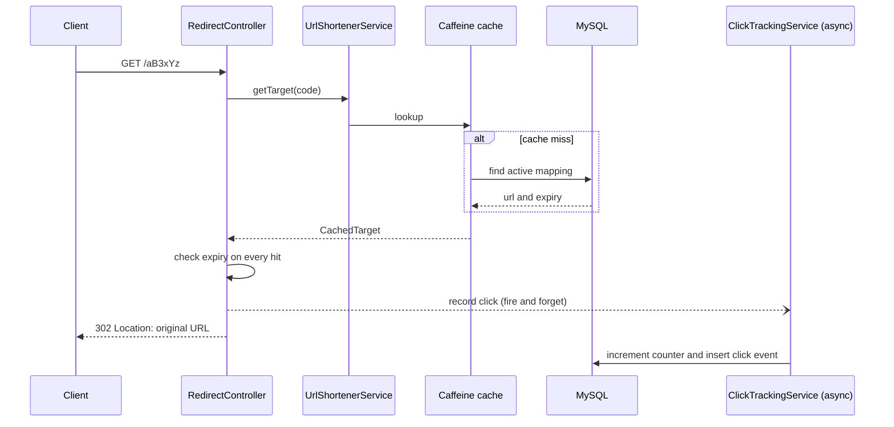

# URL Shortener


A REST API and small web UI for shortening URLs, with JWT authentication, per-user link ownership, cached redirects and click analytics that never slow down the redirect path.

**Live demo:** https://urlshortener-unmg.onrender.com
*(Hosted on free tiers: the first request after a period of inactivity can take about a minute while the server wakes up.)*

---

## Features

- **Shorten URLs** with an auto-generated code or a custom alias (4 to 10 letters or digits), and a configurable expiry (1 to 3650 days)
- **Accounts:** register and log in with a username or an email; stateless JWT authentication with BCrypt password hashing
- **Ownership:** links created while logged in belong to you; you can list them ("My URLs") and only you can deactivate them
- **Fast redirects:** Caffeine in-memory cache with the expiry re-checked on every hit
- **Click analytics:** every click is stored (time, user-agent, referrer) asynchronously, and the stats endpoint returns the last 7 days
- **Input validation:** only `http`/`https` URLs with a valid host, alias rules, and a reserved-words list so aliases cannot clash with real routes
- **Consistent errors:** one global exception handler returns the right status code (400, 401, 403, 404, 409)
- **Database migrations** with Flyway, dev/prod Spring profiles, secrets only through environment variables
- **Tested:** unit tests with JUnit 5 and Mockito, and a GitHub Actions pipeline that runs them against a real MySQL container
- **Docker-ready** and deployed on Render

## Tech stack

| Area | Technology |
|---|---|
| Language / framework | Java 17, Spring Boot 3.2 |
| Persistence | MySQL 8, Spring Data JPA (Hibernate), HikariCP |
| Security | Spring Security, JWT (JJWT), BCrypt |
| Caching | Caffeine (via Spring Cache) |
| Migrations | Flyway |
| Async | Spring `@Async` with a bounded thread pool |
| Build / CI | Maven, GitHub Actions |
| Frontend | Plain HTML, CSS and JavaScript (served by Spring Boot) |
| Deployment | Docker, Render, Aiven (MySQL) |

## How a redirect works



## API

| Method | Endpoint | Auth | Description |
|---|---|---|---|
| POST | `/api/auth/register` | public | Create an account, returns a JWT |
| POST | `/api/auth/login` | public | Log in with username **or** email, returns a JWT |
| POST | `/api/shorten` | public* | Shorten a URL (*owned by you if a valid JWT is sent, anonymous otherwise) |
| GET | `/{shortCode}` | public | `302` redirect to the original URL |
| GET | `/api/stats/{shortCode}` | public | Total clicks, status, expiry and clicks for the last 7 days |
| GET | `/api/urls` | JWT | List your links |
| DELETE | `/api/urls/{shortCode}` | JWT, owner only | Deactivate a link |
| GET | `/actuator/health` | public | Health check |

**Status codes:** `400` validation or malformed input, `401` missing or invalid credentials, `403` not the owner, `404` unknown or expired code, `409` alias or username already taken.

### Example

```bash
# Register (returns a token)
curl -X POST http://localhost:8080/api/auth/register \
  -H "Content-Type: application/json" \
  -d '{"username":"john","email":"john@example.com","password":"secret123"}'

# Shorten while logged in (replace $TOKEN with the token from above)
curl -X POST http://localhost:8080/api/shorten \
  -H "Content-Type: application/json" \
  -H "Authorization: Bearer $TOKEN" \
  -d '{"url":"https://www.example.com/a/very/long/path","customAlias":"demo01","expiryDays":30}'

# Follow the short link
curl -i http://localhost:8080/demo01

# Stats, your links, deactivate
curl http://localhost:8080/api/stats/demo01
curl http://localhost:8080/api/urls -H "Authorization: Bearer $TOKEN"
curl -X DELETE http://localhost:8080/api/urls/demo01 -H "Authorization: Bearer $TOKEN"
```

On Windows PowerShell use `curl.exe` instead of `curl`, or use Postman / the IntelliJ HTTP client.

## Run locally

**Prerequisites:** Java 17+, MySQL 8+, Maven 3.8+

```bash
git clone https://github.com/<your-github-username>/urlshortener.git
cd urlshortener
```

1. Create the database (Flyway creates the tables on first start):
   ```sql
   CREATE DATABASE url_shortener;
   ```
2. The `dev` profile reads your database login from environment variables, with local defaults of user `root` and password `12345`. Set your own if different:
   ```bash
   export DB_USERNAME=root
   export DB_PASSWORD=your_password
   ```
3. Start the app:
   ```bash
   mvn spring-boot:run
   ```
4. Open **http://localhost:8080** (open it on port 8080, not through an IDE preview server, because the page needs the running API).

Run the tests with `mvn test`.

## Configuration

| Variable | Required | Purpose |
|---|---|---|
| `SPRING_PROFILES_ACTIVE` | no | `dev` (default) or `prod` |
| `JWT_SECRET` | prod: **yes** | At least 32 characters. The app refuses to start without it in `prod` (`dev` has a local-only fallback) |
| `DB_URL`, `DB_USERNAME`, `DB_PASSWORD` | prod: yes | MySQL connection, e.g. `jdbc:mysql://HOST:PORT/DBNAME?sslMode=REQUIRED` |
| `APP_BASE_URL` | prod: yes | Public base URL used to build short links |
| `CORS_ALLOWED_ORIGINS` | no | Comma-separated origins (default `*`) |
| `PORT` | no | Server port (set automatically by Render) |

## Design decisions

- **Expiry is re-checked on every cache hit.** The cache stores the URL together with its expiry time, and the controller checks it on each request. The check cannot live inside the cached method, because a cache hit skips the method body, and calls within the same class would bypass the Spring cache proxy.
- **Analytics are off the redirect path.** The click counter update and the event insert run on a small bounded thread pool. If the queue is full, events are dropped on purpose: a traffic spike may lose some analytics, but redirects never slow down.
- **`302`, not `301`.** A permanent redirect would be cached by browsers and later clicks would never reach the server, so they could not be counted (and deactivation would not take effect for those browsers).
- **Short codes** are random 6-character Base62 strings from `SecureRandom`, so they are not guessable or sequential. Uniqueness is checked before insert and enforced by a unique index; a race surfaces as a `409`.
- **Ownership** is stored as the owner's username in `created_by`. Anonymous links (`NULL`) cannot be deactivated through the API and simply expire.
- **Stateless auth.** The JWT carries the username; an invalid or expired token is treated as anonymous, so public endpoints keep working and protected ones return `401`.
- **Flyway owns the schema.** Existing databases are baselined at version 0, and the initial migrations use `CREATE TABLE IF NOT EXISTS`, so they are safe to run against a database that already has the tables.

## Project structure

```
src/main/java/com/urlshortener/
├── config/        Security, JWT filter, cache, async executor
├── controller/    REST controllers (auth, URLs, redirect)
├── dto/           Request and response objects
├── entity/        JPA entities (User, UrlMapping, ClickEvent)
├── exception/     Custom exceptions and global handler
├── repository/    Spring Data repositories
└── service/       Business logic (URLs, auth, JWT, click tracking)
src/main/resources/
├── db/migration/  Flyway migrations
└── static/        Web UI (login page and dashboard)
```

## Known limitations and roadmap

- [ ] Rate limiting on `/api/shorten` and the auth endpoints
- [ ] Load-test results (k6) for cache hit versus miss
- [ ] Redis for a shared cache when running more than one instance (Caffeine is per instance)
- [ ] Integration tests with Testcontainers
- [ ] Retention policy for the click events table
- [ ] Short codes are case-insensitive because of the default MySQL collation (`utf8mb4_bin` on the column would fix it)
- [ ] The UI stores the JWT in `localStorage`; an HttpOnly cookie would be safer against XSS

## Author

**Utkarsh Kumar Dabgarwal**
[GitHub](https://github.com/<your-github-username>) · [LinkedIn](https://www.linkedin.com/in/<your-linkedin-handle>)
